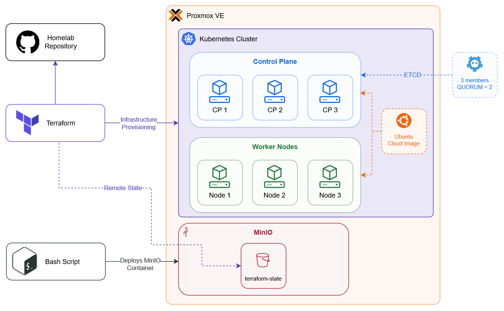

# Homelab

Infrastructure for a Proxmox-based homelab. VMs for Kubernetes are provisioned with Terraform; Terraform state is stored on a MinIO LXC on the same cluster.



## Layout

```text
proxmox/
  minio/                 # Bootstrap MinIO (LXC) for remote state
  terraform/
    kubernetes/            # Proxmox VMs for the k8s cluster
```

## Components

### Proxmox

The hypervisor. Hosts LXCs and VMs. Scripts that use `pct` must run on the Proxmox node.

### `proxmox/minio`

Bash scripts that create a Debian LXC and install MinIO (S3-compatible object storage). Used as the Terraform remote state backend so state is shared across machines (Linux/Windows), not tied to one laptop.

| File | Role |
|------|------|
| `config.sh` | CT ID, IP, template, bucket name |
| `deploy.sh` | Entrypoint — runs the full bootstrap |
| `create-lxc.sh` | Creates and starts the LXC |
| `install-minio.sh` | Installs MinIO + systemd unit inside the CT |
| `bootstrap-bucket.sh` | Creates the state bucket and writes `terraform-backend.env` |
| `minio.env.example` | Template for MinIO root credentials |

Secrets (`minio.env`, `terraform-backend.env`) are gitignored. Copy them to the machine where you run Terraform and source them before `terraform init`.

Run on the Proxmox node:

```bash
cd proxmox/minio
cp minio.env.example minio.env   # set password
# edit config.sh (IP, DNS, template)
./deploy.sh
```

### `proxmox/terraform/kubernetes`

Terraform stack (`bpg/proxmox`) that provisions:

- Ubuntu cloud-init VM template
- Kubernetes control-plane VMs
- Kubernetes worker node VMs

State is stored in MinIO via `backend.tf` (S3 backend pointing at the MinIO API). Credentials come from the environment (`AWS_ACCESS_KEY_ID` / `AWS_SECRET_ACCESS_KEY`), typically from `terraform-backend.env`.

```bash
cd proxmox/terraform/kubernetes
cp terraform.tfvars.example terraform.tfvars   # fill in values
set -a && source ../../minio/terraform-backend.env && set +a
terraform init   # use -migrate-state once when moving from local state
terraform plan
terraform apply
```
